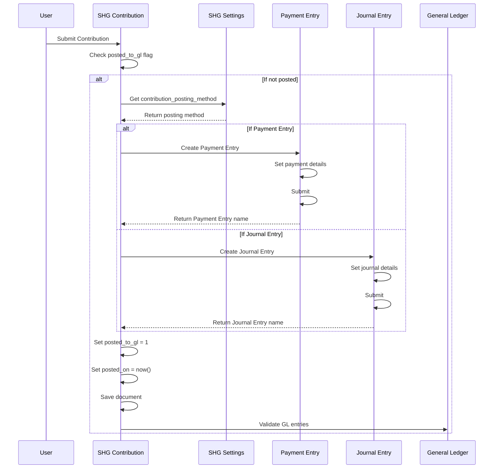
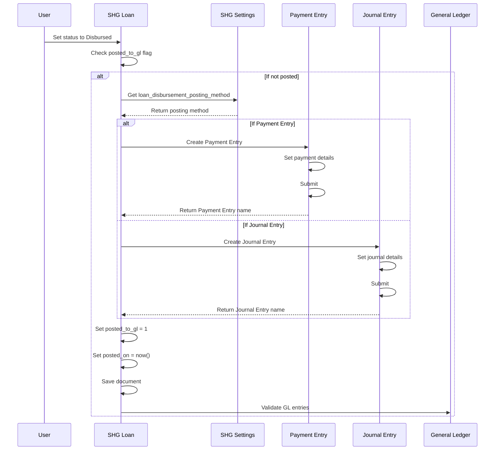
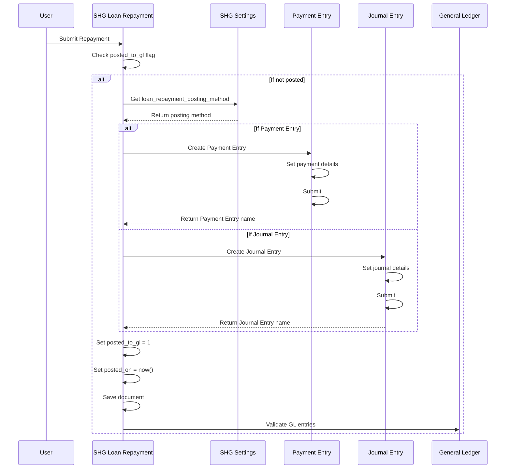
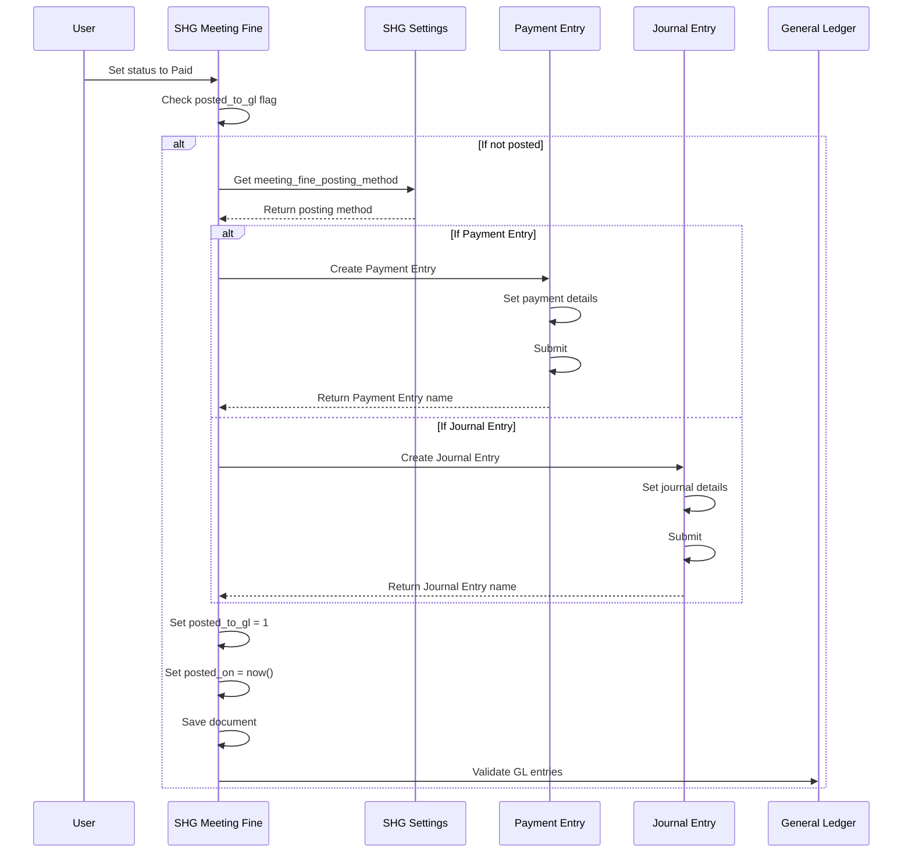

# SHG Posting Flow Sequence Diagrams

## SHG Contribution Posting Flow

## SHG Loan Disbursement Posting Flow

## SHG Loan Repayment Posting Flow

## SHG Meeting Fine Posting Flow

## Key Implementation Details

1. **Idempotency**: All flows check the `posted_to_gl` flag to prevent duplicate postings
2. **Configuration**: Posting method is determined by settings in SHG Settings
3. **Validation**: After posting, GL entries are validated to ensure correctness
4. **Traceability**: Created Journal Entries or Payment Entries are linked back to the SHG document
5. **Error Handling**: Proper error handling and logging throughout the process

This design ensures that all SHG financial transactions are properly recorded in ERPNext while maintaining full compliance with v15 validation rules.